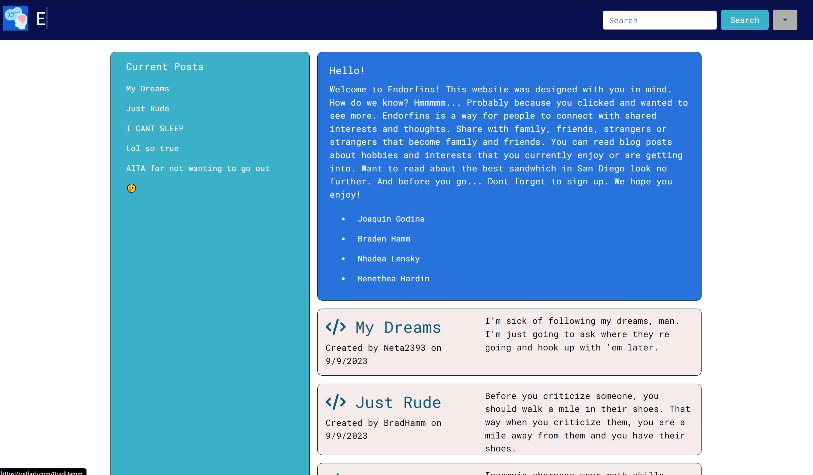
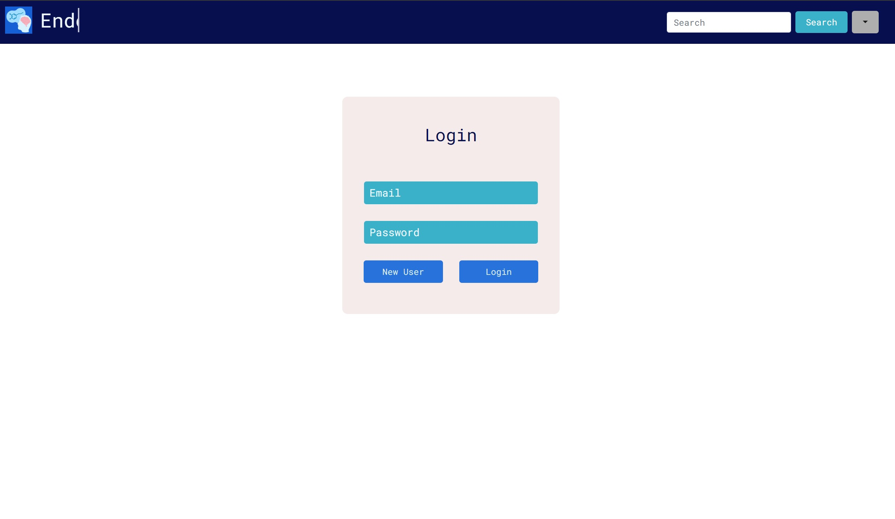
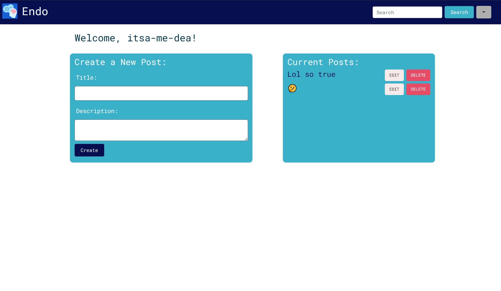
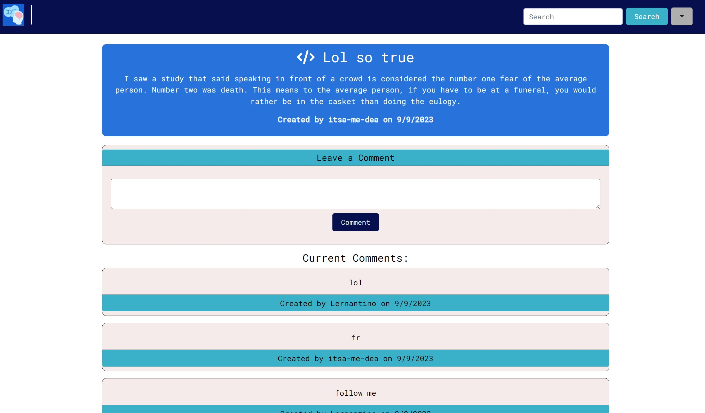
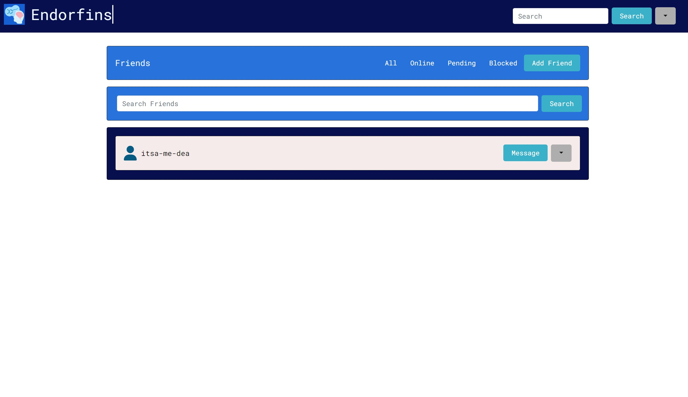

# Tech Blog

[](https://mit-license.org/)
[](https://www.contributor-covenant.org/version/2/1/code_of_conduct/)

### **[Description](#description) | [Installation](#installation) | [Usage](#usage) | [Credits](#credits) | [License](#license) | [Contribute](#contribute) | [Questions](#questions)**

## Description

Welcome to Endorfins!

Have you ever had an exciting day, gone to a new restaurant, started a new fitness routine or even lounged in bed and wanted to talk about it? Well look no further Endorfins is the place for you. Endorfins is a blogpost forum that allows you to connect with other people that have similar interests as you. With our webpage you are able to add friends, create new blog posts, and even read others blog posts that share the same interests. Maybe you are just getting into a hobby. You can connect with others using easy our easy to navigate search bar. Its quick and easy, all you have to do is sign up. Even if you sign up you can still browse and see if you would like to stay longer. We hope you enjoy our webpage!

### User Story
  ```
  As a forum website user, I would like to interact with others that have the same interest as myself. 

  I would like to be able to create an account and add friends.

  I would also like to be able to create new posts, view my old posts and search for new posts to read based off of specific tags.
  ```

## Installation

Deployed site (installation not needed): 

-OR-

Forking from Repo:
1. Fork or download repository
2. Open a terminal with the root directory
3. In the terminal, enter `npm i`
4. Update `.env` with the following (include your password if needed)
    ```
    DB_NAME='endorfins_db'
    DB_USER='root'
    DB_PASSWORD=''
    ```
5. Enter `npm run seed`
6. Enter `npm run start`
7. Open http://localhost:3001 in browser

## Usage

You will start on the homepage, where you can navigate the site via the navbar or select a post on the homepage to open.



On the navbar, selecting `Dashboard` or `Login` will prompt you to create an account or login with existing credentials.


Once logged in, you'll have access to your `Dashboard`, where you can create and edit your posts, and `Friends` (note: friends are to be implemented in a future build). Additionally, you'll be able to select other posts and add your comments to them.




## Credits

- Technologies: 
  - bcrypt
  - connect-session-sequelize
  - dotenv
  - express
  - express-handlebars
  - express-session
  - handlebars
  - mysql2
  - sequelize
- Third-party assets: 
  - https://fontawesome.com/
  - https://sequelize.org/
  - https://dev.mysql.com/
  - https://www.npmjs.com/package/dotenv
  - https://www.npmjs.com/package/express
  - https://www.npmjs.com/package/express-handlebars
  - https://www.npmjs.com/package/express-session
- Tutorials: 
  - UCSD-VIRT-FSF-PT-03-2023-U-LOLC
  - https://stackoverflow.com/questions/8158244/how-to-update-a-record-using-sequelize-for-node
  - https://www.geeksforgeeks.org/express-js-res-render-function/#
  - https://bobbyhadz.com/blog/typeerror-router-use-required-middleware-function-but-got-an-object
  - https://stackoverflow.com/questions/27465850/typeerror-router-use-requires-middleware-function-but-got-a-object
  - https://stackoverflow.com/questions/31591020/onclick-function-on-elements-in-handlebars-template
  - https://stackoverflow.com/questions/63028838/post-http-localhost3000-data-400-bad-request-when-trying-to-send-data-from

## License

 The license this application is covered under is: [MIT License](https://mit-license.org/).

## Contribute

In general, follow the "fork-and-pull" Git workflow.

  1. **Fork** the repo on GitHub.
  2. **Clone** the project to your own machine.
  3. **Commit** changes to your own branch.
  4. **Push** your work back up to your fork.
  5. Submit a **pull request** so that your changes can be reviewed.
    
  NOTE: Be sure to merge the latest from "upstream" before making a pull request!
  
  When contributing to this project, please follow the [Contributor Covenant](https://www.contributor-covenant.org/version/2/1/code_of_conduct/) code of conduct.

## Questions

You can reach out to us via GitHub:
- Joaquin Godina (https://github.com/joaquingodina0)
- Braden Hamm (https://github.com/BradHamm)
- Nhadea Lensky (https://github.com/itsa-me-dea)
- Benethea Hardin (https://github.com/neta2393)

